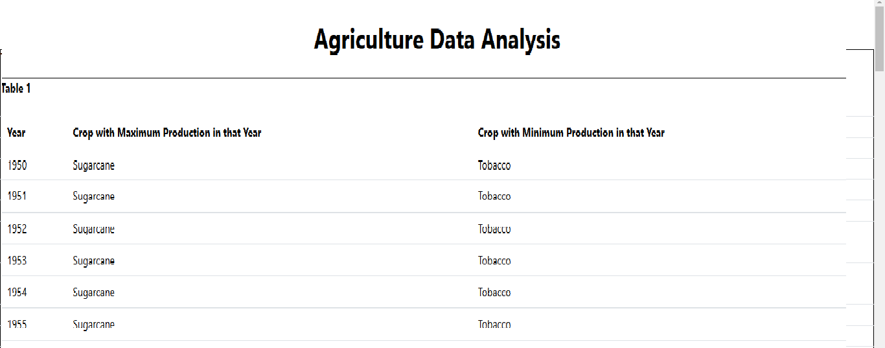
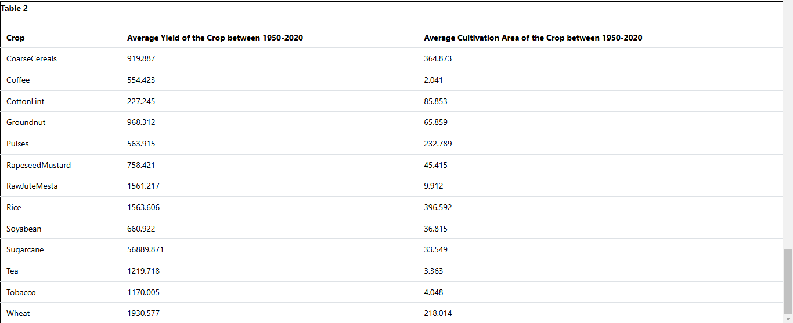

# Mantine Vite template

Get started with the template by clicking `Use this template` button on the top of the page.

[Documentation](https://mantine.dev/guides/vite/)

# Agriculture Data Analysis

1. **Project Overview**:

This project is an analytics application designed to process and display the Indian Agriculture dataset provided by NITI Aayog's National Data and Analytics Platform. The dataset includes information on crop production, yield, and cultivation area between 1950 and 2020. The application aggregates this data and displays it in two tables:

1. **Table 1:** Displays the crop with maximum and minimum production for each year from 1950 to 2020.
2. **Table 2:** Displays the average yield and average cultivation area for each crop from 1950 to 2020.

The project is built using **TypeScript** and **Mantine v7** for rendering tables.

2. **Features**:

- **Table 1:** Displays the crop with maximum and minimum production for each year between 1950 and 2020.
- **Table 2:** Shows the average yield and average cultivation area for each crop between 1950-2020.
- **Data Processing:** Handles missing data by treating all missing values as zero and rounds averages to three decimal places.

3. **Installation**:

### Prerequisites

Make sure you have the following installed:
- **Node.js** (version 14.x or higher)
- **Yarn** (package manager)

### Steps to Install

1. **Clone the repository:**

   ```bash
   git clone https://github.com/shivamkumarsingh98/Agriculture-Data-Analysis.git

   ``bash
   cd Agriculture-Data-Analysis

   ``bash
   yarn install

2. **Run this Project:**
   ```bash
   yarn dev

4. **Screenshots**:

Once the project is running, you should see two tables:

### Table 1: Crop with Maximum and Minimum Production per Year


### Table 2: Average Yield and Cultivation Area per Crop


5. **Task Details**:

Data Analysis Requirements:
Table 1: Aggregated data by year to display:

Crop with maximum production in each year from 1950 to 2020.
Crop with minimum production in each year from 1950 to 2020.

Table 2: Aggregated data by crop to display:

Average yield of each crop between 1950 and 2020.
Average cultivation area of each crop between 1950 and 2020.


6. **Folder Structure**:
   ```bash
   Agriculture-Data-Analysis/
├── data/
│   └── agricultureData.json
├── images/
│   ├── table1_crop_max_min_production.png
│   └── table2_average_yield_cultivation_area.png
├── src/
│   ├── components/
│   ├── utils/
│   ├── App.tsx
│   └── index.tsx
├── package.json
├── yarn.lock
└── README.md

8. **Technologies Used**:
TypeScript: Used for type safety and development efficiency.
Mantine v7: A React component library for rendering styled tables without the use of external CSS libraries.
Yarn: A package manager for installing dependencies.
React: JavaScript library for building user interfaces.
